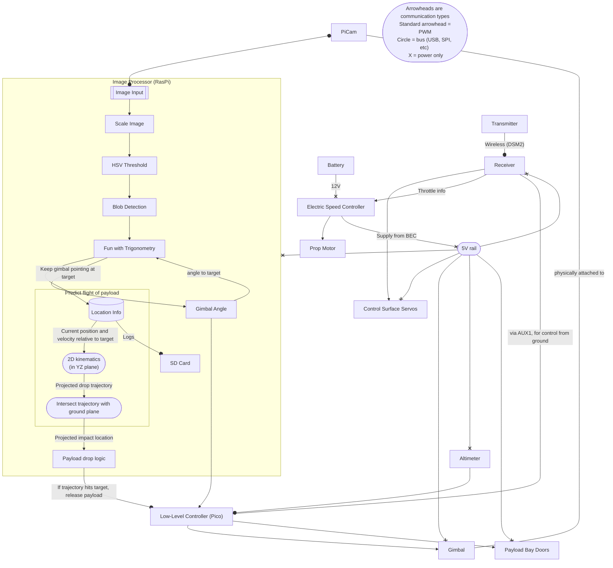
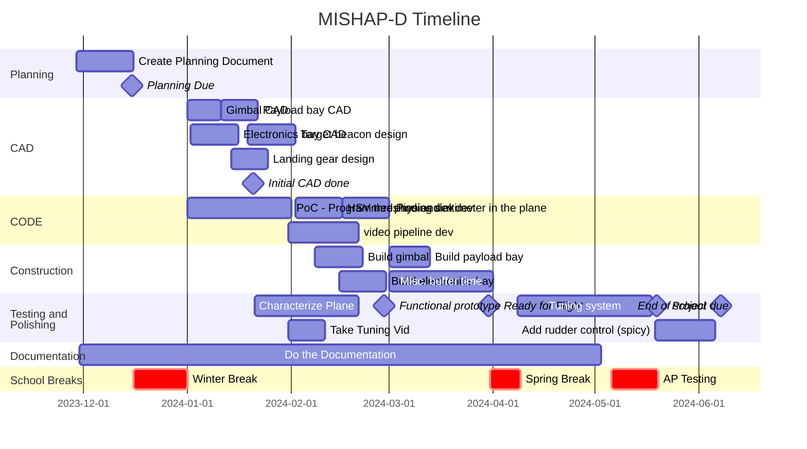

# Marginally Intelligent System for High Altitude Payload Delivery (MISHAP-D)
## The Concept:
We want to build a remote control airplane that, with a camera, can accurately find a target and drop a payload on it. There are two big challenges here: First of all, the plane has to figure out where it is with respect to the target. Second, the plane has to figure out when to drop the payload.

To simplify the problem, a human will control the plane and fly it on an approach over the target. The only thing the plane has control over is when it drops the payload. It is very important that the human flies the plane on a straight route over the target, because the plane will not be able to compensate for lateral error. (If we have extra time, we may attempt to change this with PID rudder control.)

To determine relative position, the target will be denoted several bright LEDS of a specific color. The plane will use computer vision to find the target. A gimbaled camera on the bottom of the plane will track the target. By keeping the target in the center of the frame, the angle between the plane and the target can be determined by the angle of the gimbal.

To determine when to drop the payload, the plane will be constantly running a physics simulation of what would happen if it chose that moment to drop. Only if the projected path would intersect the target, and the operator is giving the plane permission to drop, will the payload be released.

## Success statement:
* The plane will fly, collect data, and store data on a pico.
* The plane will meet all requirements to recieve an A in Engineering 4.
* The plane will accurately drop payloads on target.
## A Big Flowchart

<h3> Explanation</h3>

This is a diagram of how the system on the plane will work. Everything starts with the camera, which is mounted on a gimbal under the plane. It feeds video into a Raspberry Pi (not pico). That will run an image processing pipeline that isolates the target's beacons. Using these beacons, it will then determine the correction needed to adjust the gimbal to continue pointing at the target. Additionaly, this data will be used to calculate the plane's location relative to the target with a bit of trigonometry. The location will be logged, and a physics simulation will be run to see where the payload would land if it was dropped at that moment in time. If the payload would hit the target, and the payload drop is armed, the payload will be dropped. The command to drop the payload and the commands to keep the gimbal on target will be sent over USB to a Raspberry Pi Pico, which will serve as the low-level controller. The Pico will control the gimbal and payload bay servos, and it will also be connected to the altimeter that provides height data to the navigation system. Finally, the control surfaces and propellers of the plane will be directly controlled by an RC reciever. The only link between the plane flight system and the payload system is the arming signal, which is a simple PPM signal that runs from the reciever into the Pico. This ensures that errors in the payload system cannot result in loss of control of the plane.

## Sketches

## Proof of Concept
To validate the plane, and to secure a grade, we will first just put a RaspberryPi Pico logging altitude data in the plane. This will ensure we have *something* to submit to the assignment if the more ambitious plans fall through, and it will show that we can add our own electronics to the plane and operate them.

## What problems we will need to solve
* The plane has to calculate its location relative to its target and decide on the perfect time to drop the payload.
* The plane doesn't have a camera
* The plane lacks an intellegent controller
* The plane cannot recognize its target
* The plane cannot stay aloft
* The plane lacks aerial experience
* The plane lacks a quick release payload bay

## Parts we will need
* Raspberry Pi Pico
* Raspberry Pi B Model ?
* DSM2 Reciever
* DSM2 Transmitter
* Model Airplane
* Servo motors
* 3S LiPo battery

## Safety
### Isolated systems
To ensure that a failure of the payload system will not affect the flyability of the plane, the payload system will be almost entirely isolated from the plane flight system. The only links between the two systems are the 5V power rail and the arming signal that runs from the plane flight system to the payload system. (This may change if we have extra time, in which case we may give the payload system rudder control. If we do this, we will have an override switch so we can always take control of the plane if the guidance fails.) 
### LiPo batteries
When charging the LiPo batteries that power the plane, we will be cautions to avoid a battery fire. To accomplish this, we will always charge batteries either under direct supervision or in a LiPo safety pouch.
### Targeting
Dropping objects from altitude is inherently dangerous. To mitigate the risk of injury, we will begin by dropping light objects over targets far away from people or obstacles. Once we develop confidence in our system, we will advance to dropping non-dangerous objects (like water balloons) on people. The targets will wear head protection and safety glasses as an extra safety measure.
## Schedule

