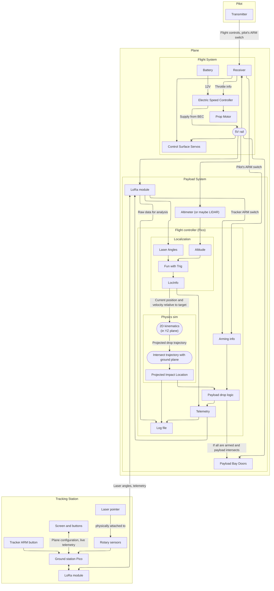
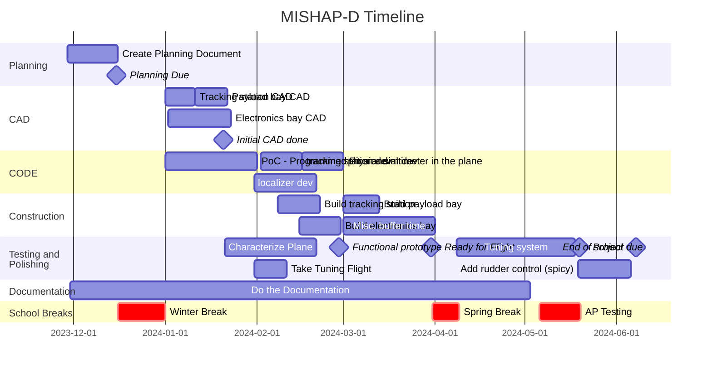

# Marginally Intelligent System for High Altitude Payload Delivery (MISHAP-D)
## The Concept:
We want to build a remote control airplane that, with a camera, can accurately find a target and drop a payload on it. There are two big challenges here: First of all, the plane has to figure out where it is with respect to the target. Second, the plane has to figure out when to drop the payload.

To simplify the problem, a human will control the plane and fly it on an approach over the target. The only thing the plane has control over is when it drops the payload. It is very important that the human flies the plane on a straight route over the target, because the plane will not be able to compensate for lateral error. (If we have extra time, we may attempt to change this with PID rudder control.)

To determine relative position, a human will point a laser pointer at the plane. The angle of the laser pointer will then be transmitted to the plane, which will triangulate its position.

To determine when to drop the payload, the plane will be constantly running a physics simulation of what would happen if it chose that moment to drop. Only if the projected path would intersect the target, and the operator is giving the plane permission to drop, will the payload be released.

## Success statement:
* The plane will fly, collect data, and store data on a pico.
* The plane will meet all requirements to recieve an A in Engineering 4.
* The plane will accurately drop payloads on target.
## A Big Flowchart

<h3> Explanation</h3>

This is a diagram of how the systems will work. There are three main systems: The pilot, the tracking station, and the plane. The pilot is simplest: They just have a transmitter talking to a standard R/C reciever on the plane. The tracker station consists of a laser pointer mounted on some sensors that can read the angle the laser pointer is at. The tracker points the laser at the plane. The tracking station sends this data to the plane, which it uses to triangulate its position. The tracker station is also capable of recieving live telemetry and adjusting settings, like target location. The plane has the most going on. The flight system flies the plane nearly identically to a standard R/C airplane. The payload system deals with everything else. By design, the flight and payload systems are fairly isolated, with only power and a single piece of information flowing from the flight system to the payload system, and nothing flowing the other way. This ensures that if (when) the payload system fails, the plane can still be flown safely to a landing. The payload system has some sensors and a Raspberry Pi Pico running two main subsystems: A localizer to determine its position relative to its target, and a physics simulation to determine the path of its payload when dropped. The flight system also logs and transmits telemetry information for troubleshooting.

## Sketches

## Proof of Concept
To validate the plane, and to secure a grade, we will first just put a RaspberryPi Pico logging altitude data in the plane. This will ensure we have *something* to submit to the assignment if the more ambitious plans fall through, and it will show that we can add our own electronics to the plane and operate them.

## What problems we will need to solve
* The plane has to calculate its location relative to its target and decide on the perfect time to drop the payload.
* The plane lacks an intellegent controller
* The plane cannot stay aloft
* The plane lacks aerial experience
* The plane lacks a quick release payload bay

## Parts we will need
* Raspberry Pi Pico (x2)
* DSM2 Reciever
* DSM2 Transmitter
* Model Airplane
* Servo motors
* 3S LiPo battery
* Laser pointer
* Screen
* Buttons
* LoRa tranceiver

## Safety
### Isolated systems
To ensure that a failure of the payload system will not affect the flyability of the plane, the payload system will be almost entirely isolated from the plane flight system. The only links between the two systems are the 5V power rail and the arming signal that runs from the plane flight system to the payload system. (This may change if we have extra time, in which case we may give the payload system rudder control. If we do this, we will have an override switch so we can always take control of the plane if the guidance fails.) 
### LiPo batteries
When charging the LiPo batteries that power the plane, we will be cautions to avoid a battery fire. To accomplish this, we will always charge batteries either under direct supervision or in a LiPo safety pouch.
### Targeting
Dropping objects from altitude is inherently dangerous. The payload bay will only be able to open if the tracker and the pilot have both ARMed. To mitigate the risk of injury, we will begin by dropping light objects over targets far away from people or obstacles. Once we develop confidence in our system, we will advance to dropping non-dangerous objects (like water balloons) on people. The targets will wear head protection and safety glasses as an extra safety measure.
### Lasers
The laser pointer used for tracking may need to be quite powerful. The laser will only be activated when it could not point at humans, and when there is full-scale aviation in the area tracking will not be conducted.
## Schedule

## Revisions
* 2023-12-13: First revision
* 2023-12-25: Switch from using vision to using lasers for localization.
